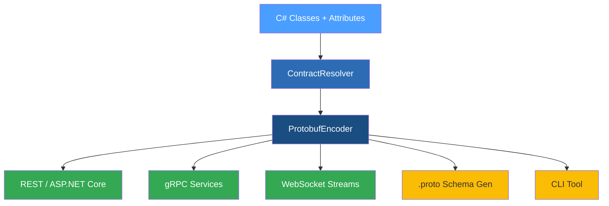
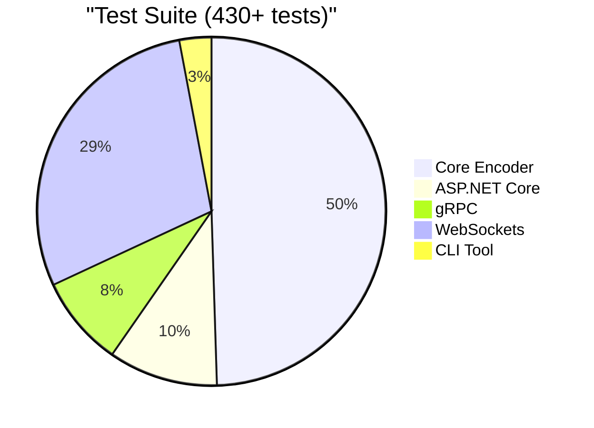

# Proto ~ Buffed

**ProtobuffEncoder** is a high-performance, zero-dependency protobuf serialisation framework for .NET 8, 9, and 10. Define your contracts in pure C#, and the framework handles everything else: binary encoding, streaming transport, validation, ASP.NET Core integration, gRPC, WebSockets, and `.proto` schema generation — all without Google.Protobuf or `protoc`.

> Whether you are building microservices, real-time pipelines, or simply need a compact wire format, ProtobuffEncoder gives you full protobuf compatibility with nothing more than a NuGet reference.

## How It Works



## Packages

| Package | What It Does | Targets |
|---------|-------------|---------|
| `ProtobuffEncoder` | Core encoder, decoder, transport, validation, and schema | .NET 8 / 9 / 10 |
| `ProtobuffEncoder.AspNetCore` | MVC formatters, HttpClient extensions, builder pattern | .NET 8 / 9 / 10 |
| `ProtobuffEncoder.Grpc` | Code-first gRPC marshaller, client proxy, service discovery | .NET 8 / 9 / 10 |
| `ProtobuffEncoder.WebSockets` | Managed WebSocket client and server, connection manager, retry policies | .NET 8 / 9 / 10 |
| `ProtobuffEncoder.Contracts` | Example contracts and service interfaces | .NET 8 / 9 / 10 |
| `ProtobuffEncoder.Tool` | CLI tool for `.proto` generation and `.csproj` patching | .NET 8 / 9 / 10 |
| `ProtobuffEncoder.Analyzers` | Roslyn analyser with 10 compile-time diagnostics (PROTO001–PROTO010) | netstandard2.0 |

## Quick Start

### 1. Define a contract

```C#
[ProtoContract]
public class WeatherRequest
{
    [ProtoField(1)] public string City { get; set; } = "";
    [ProtoField(2)] public int Days { get; set; }
}
```

### 2. Encode and decode

```C#
var request = new WeatherRequest { City = "Amsterdam", Days = 5 };
byte[] bytes = ProtobufEncoder.Encode(request);
WeatherRequest decoded = ProtobufEncoder.Decode<WeatherRequest>(bytes);
```

### 3. Stream over a transport

```C#
await using var sender = new ProtobufSender<WeatherRequest>(networkStream);
await sender.SendAsync(request);
```

### 4. Generate a .proto schema

```C#
string proto = ProtoSchemaGenerator.Generate(typeof(WeatherRequest));
// syntax = "proto3";
// message WeatherRequest {
//   string City = 1;
//   int32 Days = 2;
// }
```

## Supported Types

| Category | Types |
|----------|-------|
| **Integers** | `byte`, `sbyte`, `short`, `ushort`, `int`, `uint`, `long`, `ulong`, `nint`, `nuint` |
| **Floating point** | `float`, `double`, `Half`, `decimal` |
| **Boolean** | `bool` |
| **Text** | `string` (with configurable encoding and full emoji support) |
| **Binary** | `byte[]` |
| **Date and time** | `DateTime`, `DateTimeOffset`, `TimeSpan`, `DateOnly`, `TimeOnly` |
| **Identifiers** | `Guid`, `Uri`, `Version` |
| **Large numbers** | `Int128`, `UInt128`, `BigInteger`, `Complex` |
| **Enums** | Any `enum` type |
| **Collections** | `List<T>`, `T[]`, `IList<T>`, `ICollection<T>`, `HashSet<T>`, `ISet<T>` |
| **Dictionaries** | `Dictionary<K,V>`, `IDictionary<K,V>`, `IReadOnlyDictionary<K,V>` |
| **Nested messages** | Any class with `[ProtoContract]`, or implicitly via auto-discovery |
| **Nullable** | `T?` for all value types |

## Quality at a Glance



| Test Project | Tests | Covers |
|-------------|-------|--------|
| ProtobuffEncoder.Tests | 200+ | Core encoder, decoder, streaming, validation, schema, attributes |
| ProtobuffEncoder.AspNetCore.Tests | 41 | Formatters, HttpClient, setup, DI integration |
| ProtobuffEncoder.Grpc.Tests | 34 | Marshaller, service discovery, client proxy, extensions |
| ProtobuffEncoder.WebSockets.Tests | 117 | Client, server, connection manager, retry, stream |
| ProtobuffEncoder.Tool.Tests | 12 | Project modifier, `.csproj` patching |

## Documentation Map

### Core Concepts

| Topic | What You Will Learn |
|-------|-------------|
| [Getting Started](getting_started.md) | Installation, first contract, encode and decode |
| [Attributes Reference](attributes_reference.md) | All 8 attributes with properties and examples |
| [Serialisation Deep Dive](serialization_deep_dive.md) | Wire format, type mapping, encoding steps |
| [Auto-Discovery](auto_discovery.md) | ProtoRegistry, field numbering strategies, assembly scanning |
| [Value Encoding](value_encoding.md) | ProtoEncoding, ProtoValue, ProtoMessage, emoji support |
| [Transport Layer](transport_layer.md) | Sender, Receiver, DuplexStream, ValueSender and ValueReceiver |
| [Validation Pipeline](validation_pipeline.md) | ValidationPipeline, validated transport |

### Schema

| Topic | What You Will Learn |
|-------|-------------|
| [Schema Generation](schema_generation.md) | ProtoSchemaGenerator, imports, services |
| [Schema Decoding](schema_decoding.md) | ProtoSchemaParser, SchemaDecoder, ProtobufWriter |

### Integrations

| Topic | What You Will Learn |
|-------|-------------|
| [ASP.NET Core](aspnetcore_integration.md) | Builder pattern, REST formatters, HttpClient |
| [gRPC](grpc_integration.md) | Marshaller, client proxy, service discovery |
| [WebSockets](websocket_integration.md) | Client, server, connection manager, retry |

### Tools and Quality

| Topic | What You Will Learn |
|-------|-------------|
| [CLI Tool](cli_tool.md) | Schema generation, `.csproj` patching |
| [Test Strategy](test_strategy_overview.md) | FIRST-U patterns, 430+ tests |
| [Benchmarks](benchmarks_overview.md) | Performance results across .NET 8, 9, and 10 |
| [Demos](demos_overview.md) | Demo project walkthroughs |
