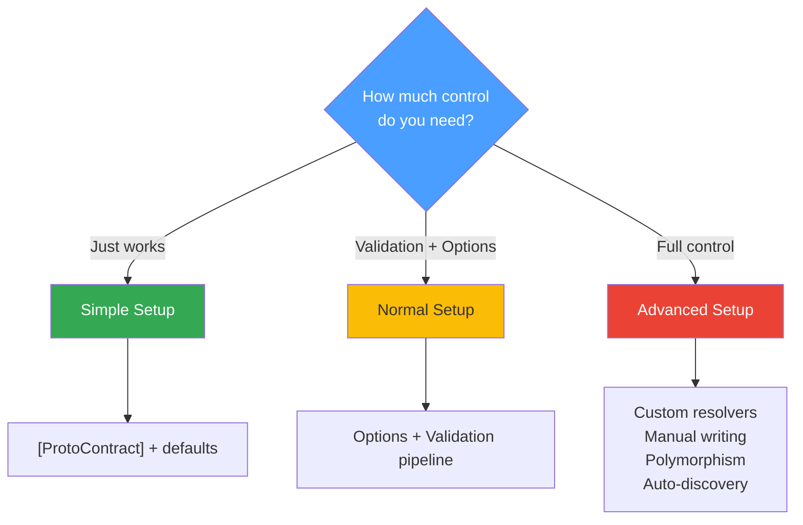

# Advanced Setup

The advanced setup covers scenarios where you need maximum control over the serialisation process. Use this when working with third-party types, ultra-high-throughput hot paths, or polymorphic inheritance hierarchies.

## Custom Contract Resolvers

When you need to serialise types from external libraries or apply non-standard metadata, implement a custom `IContractResolver`:

```C#
public class MyResolver : IContractResolver
{
    public MessageDescriptor Resolve(Type type) => // custom logic here
}

// Register in DI
builder.Services.AddSingleton<IContractResolver, MyResolver>();
```

## Low-Level Manual Writing

For code paths where every nanosecond counts, bypass reflection entirely and use the `ProtobufWriter` directly. This writes raw protobuf fields to any `Stream` with zero intermediate allocations:

```C#
app.MapPost("/high-perf", async (HttpContext context) =>
{
    await using var writer = new ProtobufWriter(context.Response.Body);
    writer.WriteString(1, "Direct String");
    writer.WriteInt32(2, 123);
    // No reflection, no intermediate object allocations
});
```

## Polymorphism with [ProtoInclude]

Support for inheritance hierarchies is handled through the `[ProtoInclude]` attribute on base classes. Each derived type is mapped to a dedicated field number:

```C#
[ProtoContract]
[ProtoInclude(10, typeof(Dog))]
[ProtoInclude(11, typeof(Cat))]
public class Animal
{
    [ProtoField(1)] public string Name { get; set; } = "";
}
```

During encoding, the derived type's additional fields are wrapped in a nested message at the specified field number. Decoding reconstructs the correct type automatically.

## Auto-Discovery (No Attributes)

For rapid prototyping or when you prefer convention over configuration, enable auto-discovery through the `ProtoRegistry`:

```C#
ProtoRegistry.Configure(opts =>
{
    opts.AutoDiscover = true;
    opts.DefaultFieldNumbering = FieldNumbering.Alphabetical;
});

// Any class can now be serialised — no [ProtoContract] needed
var bytes = ProtobufEncoder.Encode(myPlainObject);
```

See [Auto-Discovery](auto_discovery.md) for the full guide on registration strategies and field numbering.

## Choosing Your Approach



---

*Full source: [Program_Advanced.cs](https://github.com/IsMikeTaken/ProtobuffEncoder/blob/master/demos/ProtobuffEncoder.Demo.Setup/Program_Advanced.cs)*
