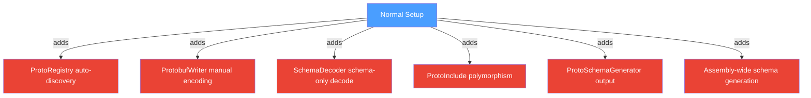
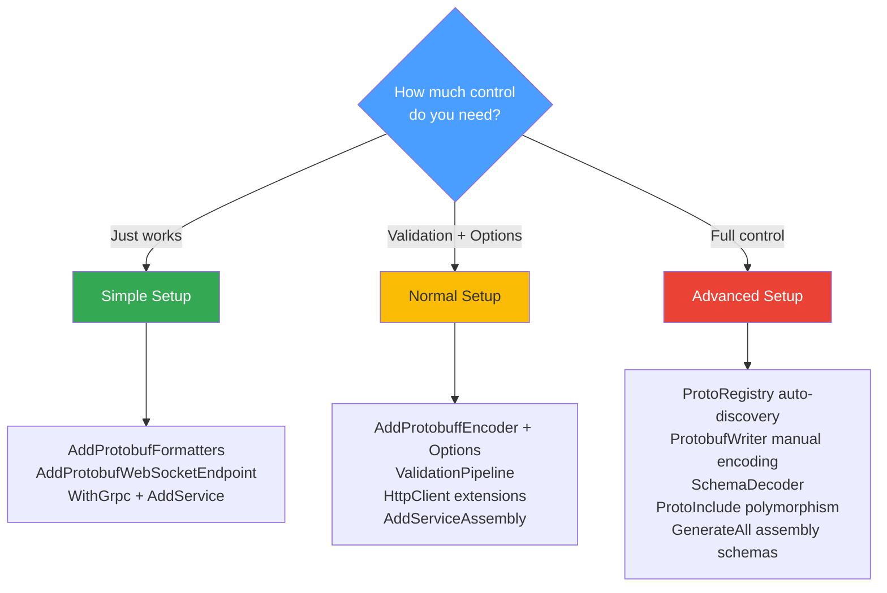

# Advanced Setup

The Advanced tier is for scenarios that demand maximum control: auto-discovery without attributes, manual wire-level encoding, polymorphic inheritance, schema-only decoding, and assembly-wide schema generation. Each demo prints its resolver output to the console so you can see exactly how the framework interprets your types.

## What Changes from Normal



---

## REST

### Auto-Discovery via ProtoRegistry

Register plain C# classes — no `[ProtoContract]` needed. The resolver assigns field numbers based on the strategy you choose:

```C#
// Explicit registration with a named strategy.
ProtoRegistry.Register<Customer>(FieldNumbering.Alphabetical);
ProtoRegistry.Register<Invoice>(FieldNumbering.DeclarationOrder);

// Or enable global auto-discovery for any class.
ProtoRegistry.Configure(opts =>
{
    opts.AutoDiscover = true;
    opts.DefaultFieldNumbering = FieldNumbering.TypeThenAlphabetical;
});
```

When the demo starts, it prints the resolver output for each type:

```text
── Customer (Alphabetical) ──
syntax = "proto3";
message Customer {
  string Email = 1;
  bool   IsActive = 2;
  string Name = 3;
}

── Invoice (DeclarationOrder) ──
syntax = "proto3";
message Invoice {
  string       Number = 1;
  string       CustomerName = 2;
  repeated string LineItems = 3;
  double       Total = 4;
}

── Product (Auto-discovered, TypeThenAlphabetical) ──
syntax = "proto3";
message Product {
  string       Category = 1;
  string       Name = 2;
  double       Price = 3;
  repeated string Tags = 4;
}
```

> **Key insight:** Alphabetical numbering sorts by property name (`Email` before `Name`). DeclarationOrder follows source order. TypeThenAlphabetical groups scalars first, then collections, then nested messages — alphabetically within each group.

### Polymorphism with [ProtoInclude]

Map derived types to dedicated field numbers on the base class. The encoder wraps each subtype's fields in a nested message at that number:

```C#
[ProtoContract]
[ProtoInclude(10, typeof(Circle))]
[ProtoInclude(11, typeof(Rectangle))]
public class Shape
{
    [ProtoField(1)] public string Name { get; set; } = "";
}

[ProtoContract]
public class Circle : Shape
{
    [ProtoField(1)] public double Radius { get; set; }
}
```

Round-trip example output:

```text
Encoded Circle → 22 bytes
Decoded as Circle: Name=MyCircle
Radius=5
```

### ProtobufWriter — Manual Wire-Level Encoding

For ultra-high-throughput paths, bypass all reflection and write raw protobuf fields directly:

```C#
app.MapPost("/api/manual", (HttpContext context) =>
{
    var writer = new ProtobufWriter();
    writer.WriteString(1, "Manual Response");
    writer.WriteVarint(2, 42);
    writer.WriteDouble(3, 3.14159);
    writer.WriteBool(4, true);

    var rawBytes = writer.ToByteArray();
    context.Response.ContentType = "application/x-protobuf";
    return context.Response.Body.WriteAsync(rawBytes).AsTask();
});
```

### SchemaDecoder — Decode Without CLR Types

Generate a `.proto` schema from a type, then decode raw bytes using only that schema. This is useful when the receiver does not have a compile-time reference to the sender's assembly:

```C#
var protoSchema = ProtoSchemaGenerator.Generate(typeof(Customer));
var decoder = SchemaDecoder.FromProtoContent(protoSchema);
var message = decoder.Decode("Customer", rawBytes);
```

*Full source: [Advanced/Rest/Program.cs](https://github.com/IsMikeTaken/ProtobuffEncoder/blob/master/demos/Setup/Advanced/Rest/Program.cs)*

---

## WebSockets

### Auto-Discovered Types over WebSockets

Combine `ProtoRegistry` auto-discovery with WebSocket endpoints. The types below have no attributes — the resolver assigns field numbers alphabetically:

```C#
public class SensorReading
{
    public string SensorId { get; set; } = "";
    public double Value { get; set; }
    public string Unit { get; set; } = "";
}

public class SensorCommand
{
    public string SensorId { get; set; } = "";
    public int IntervalMs { get; set; } = 1000;
}
```

Resolver output:

```text
── SensorReading (auto-discovered, Alphabetical) ──
syntax = "proto3";
message SensorReading {
  string SensorId = 1;
  string Unit = 2;
  double Value = 3;
}

── SensorCommand (auto-discovered, Alphabetical) ──
syntax = "proto3";
message SensorCommand {
  int32  IntervalMs = 1;
  string SensorId = 2;
}
```

### Validation + Broadcast

The endpoint combines receive-side validation with a broadcast pattern via the `WebSocketConnectionManager`:

```C#
app.MapProtobufWebSocket<SensorReading, SensorCommand>("/ws/sensors", options =>
{
    options.ConfigureReceiveValidation = pipeline =>
    {
        pipeline.Require(cmd => !string.IsNullOrWhiteSpace(cmd.SensorId), "SensorId is required.");
        pipeline.Require(cmd => cmd.IntervalMs >= 100, "IntervalMs must be at least 100.");
    };

    options.OnMessage = async (conn, command) =>
    {
        var random = new Random();
        for (var i = 0; i < 3; i++)
        {
            await conn.SendAsync(new SensorReading
            {
                SensorId = command.SensorId,
                Value = Math.Round(random.NextDouble() * 100, 2),
                Unit = "°C"
            });
            await Task.Delay(command.IntervalMs);
        }
    };
});
```

For broadcast to all connected clients, inject the connection manager:

```C#
var manager = app.Services
    .GetRequiredService<WebSocketConnectionManager<ChatReply, ChatMessage>>();
await manager.BroadcastAsync(new ChatReply { Text = "Hello everyone!" });
```

### ProtobufWriter Output

The demo also shows manual wire construction and its hex output:

```text
── ProtobufWriter demo ──
  Manual SensorReading: 26 bytes
  Hex: 0A0E74656D7065726174757265...
```

*Full source: [Advanced/WebSockets/Program.cs](https://github.com/IsMikeTaken/ProtobuffEncoder/blob/master/demos/Setup/Advanced/WebSockets/Program.cs)*

---

## gRPC

### Assembly-Wide Schema Generation

`ProtoSchemaGenerator.GenerateAll` scans an assembly and produces a `.proto` file for every registered and attributed type:

```C#
var allSchemas = ProtoSchemaGenerator.GenerateAll(typeof(Program).Assembly);
// Generated 4 .proto file(s):
//   InventoryItem  (312 chars)
//   StockLevel     (287 chars)
//   DemoRequest    (198 chars)
//   ...
```

### Schema-Only Decode over gRPC

Encode an auto-discovered type, then decode it through a schema without any CLR type reference:

```C#
var item = new InventoryItem { Sku = "WIDGET-01", Name = "Widget", Quantity = 42, UnitPrice = 9.99 };
var encoded = ProtobufEncoder.Encode(item);

var schema = ProtoSchemaGenerator.Generate(typeof(InventoryItem));
var decoder = SchemaDecoder.FromProtoContent(schema);
var decoded = decoder.Decode("InventoryItem", encoded);
```

Console output:

```text
── Registration status ──
  InventoryItem   registered:  True
  InventoryItem   numbering:   DeclarationOrder
  StockLevel      registered:  False  (auto-discover)
  StockLevel      resolvable:  True

── InventoryItem (DeclarationOrder) ──
syntax = "proto3";
message InventoryItem {
  string Sku = 1;
  string Name = 2;
  int32  Quantity = 3;
  double UnitPrice = 4;
}

── StockLevel (auto-discovered, Alphabetical) ──
syntax = "proto3";
message StockLevel {
  bool   InStock = 1;
  int32  Quantity = 2;
  string Sku = 3;
  string Warehouse = 4;
}

── Schema-only decode demo ──
  Encoded InventoryItem: 28 bytes
  Decoded via schema: { Sku=WIDGET-01, Name=Widget, Quantity=42, UnitPrice=9.99 }
```

### Mixed Attributed and Auto-Discovered Services

You can have `[ProtoService]` interfaces whose request and response types use auto-discovery:

```C#
[ProtoService("InventoryService")]
public interface IInventoryGrpcService
{
    [ProtoMethod(ProtoMethodType.Unary)]
    Task<StockLevel> CheckStock(InventoryItem request);
}
```

Here `InventoryItem` and `StockLevel` are plain classes — the resolver handles them through the registry while the service interface uses standard `[ProtoService]` attributes.

*Full source: [Advanced/Grpc/Program.cs](https://github.com/IsMikeTaken/ProtobuffEncoder/blob/master/demos/Setup/Advanced/Grpc/Program.cs)*

---

## Choosing Your Approach



## Running the Demos

```bash
# REST (prints resolver output, schema, polymorphism round-trip)
dotnet run --project demos/Setup/Advanced/Rest

# WebSockets (prints schemas, raw writer hex, starts sensor + chat endpoints)
dotnet run --project demos/Setup/Advanced/WebSockets

# gRPC (prints registration status, all schemas, schema-only decode)
dotnet run --project demos/Setup/Advanced/Grpc
```
