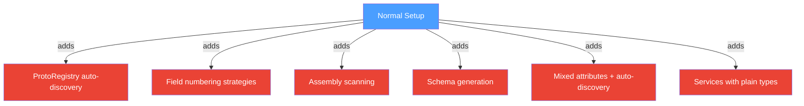
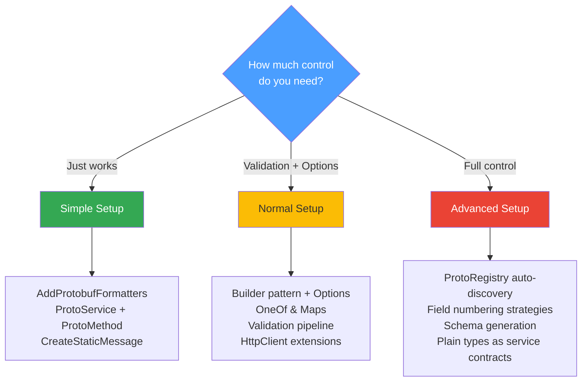

# Advanced Setup

The Advanced tier is for scenarios that demand maximum control: auto-discovery without attributes, the ProtoRegistry, field numbering strategies, assembly scanning, schema generation, and mixing attributed and plain types. The service interface defined here uses auto-discovered request and response types.

## What Changes from Normal



---

## Auto-Discovery

Register a plain C# class — no `[ProtoContract]` needed. The resolver assigns field numbers based on the strategy you choose:

```C#
public class Customer
{
    public string Name { get; set; } = "";
    public string Email { get; set; } = "";
    public decimal CreditLimit { get; set; }
}

ProtoRegistry.Register<Customer>(FieldNumbering.Alphabetical);

var customer = new Customer { Name = "Acme Ltd", Email = "info@acme.co.uk", CreditLimit = 50_000m };
byte[] bytes = ProtobufEncoder.Encode(customer);
var decoded = ProtobufEncoder.Decode<Customer>(bytes);
```

### Assembly Scanning

`RegisterAssembly` finds every public class with at least one public read/write property and registers it in one call:

```C#
int count = ProtoRegistry.RegisterAssembly(Assembly.GetExecutingAssembly());
```

### Global Auto-Discover

Enable auto-discover mode so any class can be serialised without explicit registration:

```C#
ProtoRegistry.Configure(opts =>
{
    opts.AutoDiscover = true;
    opts.DefaultFieldNumbering = FieldNumbering.Alphabetical;
});
```

With this in place, any class is resolvable:

```C#
public class Invoice
{
    public string Number { get; set; } = "";
    public decimal Amount { get; set; }
    public string Currency { get; set; } = "GBP";
    public DateTime DueDate { get; set; }
}

var bytes = ProtobufEncoder.Encode(invoice);  // no registration needed
bool resolvable = ProtoRegistry.IsResolvable(typeof(Invoice));  // true
```

---

## Field Numbering Strategies

The three strategies control how the resolver assigns field numbers to properties without a `[ProtoField]` attribute:

| Strategy | Rule | Example order for `Product` |
|---|---|---|
| `DeclarationOrder` | Source declaration order | Name=1, Price=2, Category=3 |
| `Alphabetical` | Property name, A–Z | Category=1, Name=2, Price=3 |
| `TypeThenAlphabetical` | Scalars, then collections, then messages — alphabetically within each group | Category=1, Name=2, Price=3 |

```C#
public class Product
{
    public string Name { get; set; } = "";
    public decimal Price { get; set; }
    public string Category { get; set; } = "";
}
```

Per-type overrides let you mix strategies within the same application:

```C#
ProtoRegistry.Register<Product>(FieldNumbering.Alphabetical);
ProtoRegistry.Register<Customer>(FieldNumbering.DeclarationOrder);
```

---

## Mixing Attributes and Auto-Discovery

When a class has `[ProtoField]` attributes, they always take precedence over the registry's numbering strategy. This lets you gradually migrate from auto-discovery to explicit contracts:

```C#
[ProtoContract]
public class AttributedProduct
{
    [ProtoField(10)] public string Sku { get; set; } = "";
    [ProtoField(20)] public string Title { get; set; } = "";
    [ProtoField(30)] public double Weight { get; set; }
}
```

With `AutoDiscover = true`, both attributed and plain types work side by side:

```C#
ProtoRegistry.Configure(opts => opts.AutoDiscover = true);

var attributed = new AttributedProduct { Sku = "SKU-001", Title = "Premium Widget", Weight = 1.5 };
var plain = new Customer { Name = "Plain Co", Email = "plain@example.com", CreditLimit = 10_000m };

ProtobufEncoder.Encode(attributed);  // uses field numbers 10, 20, 30
ProtobufEncoder.Encode(plain);       // uses auto-assigned numbers
```

---

## Schema Generation

`ProtoSchemaGenerator.Generate` produces a `.proto` definition from any resolvable type. Useful for interop with other languages:

```C#
string schema = ProtoSchemaGenerator.Generate(typeof(AttributedProduct));
Console.WriteLine(schema);
```

Output:

```text
syntax = "proto3";
message AttributedProduct {
  string Sku = 10;
  string Title = 20;
  double Weight = 30;
}
```

`GenerateAll` scans an assembly and returns one `.proto` string per type:

```C#
Dictionary<string, string> allSchemas = ProtoSchemaGenerator.GenerateAll(Assembly.GetExecutingAssembly());
```

---

## Service Interface with Auto-Discovered Types

The service interface uses `[ProtoService]` and `[ProtoMethod]` attributes, but the request and response types are plain classes handled by the registry:

```C#
public class InventoryQuery
{
    public string Sku { get; set; } = "";
    public string Warehouse { get; set; } = "";
}

public class StockLevel
{
    public string Sku { get; set; } = "";
    public int Quantity { get; set; }
    public bool InStock { get; set; }
    public string Warehouse { get; set; } = "";
}

[ProtoService("InventoryService")]
public interface IInventoryService
{
    [ProtoMethod(ProtoMethodType.Unary)]
    Task<StockLevel> CheckStock(InventoryQuery query);

    [ProtoMethod(ProtoMethodType.ServerStreaming)]
    IAsyncEnumerable<StockLevel> WatchStock(
        InventoryQuery query, CancellationToken ct = default);
}
```

---

## REST

### Auto-Discovery and Schema Endpoints

Register types explicitly or enable global auto-discover, then expose schema introspection alongside your API:

```C#
ProtoRegistry.Register<Customer>(FieldNumbering.Alphabetical);
ProtoRegistry.Configure(opts => opts.AutoDiscover = true);

app.MapPost("/api/customer", (Customer customer) =>
    Results.Ok(new { customer.Name, customer.CreditLimit }));

app.MapGet("/api/schema/{type}", (string type) =>
{
    var resolved = ProtoRegistry.RegisteredTypes
        .FirstOrDefault(t => t.Name == type);
    return resolved is not null
        ? Results.Ok(ProtoSchemaGenerator.Generate(resolved))
        : Results.NotFound();
});
```

*Full source: [Advanced/Rest/Program.cs](https://github.com/IsMikeTaken/ProtobuffEncoder/blob/master/demos/Setup/Advanced/Rest/Program.cs)*

---

## WebSockets

### Auto-Discovered Types over WebSockets

Combine registry auto-discovery with WebSocket endpoints. The types below have no attributes:

```C#
public class SensorReading
{
    public string SensorId { get; set; } = "";
    public double Value { get; set; }
    public string Unit { get; set; } = "";
}

public class SensorCommand
{
    public string SensorId { get; set; } = "";
    public int IntervalMs { get; set; } = 1000;
}

app.MapProtobufWebSocket<SensorReading, SensorCommand>("/ws/sensors", options =>
{
    options.ConfigureReceiveValidation = pipeline =>
    {
        pipeline.Require(cmd => !string.IsNullOrWhiteSpace(cmd.SensorId), "SensorId is required.");
        pipeline.Require(cmd => cmd.IntervalMs >= 100, "IntervalMs must be at least 100.");
    };

    options.OnMessage = async (conn, command) =>
    {
        var random = new Random();
        for (var i = 0; i < 3; i++)
        {
            await conn.SendAsync(new SensorReading
            {
                SensorId = command.SensorId,
                Value = Math.Round(random.NextDouble() * 100, 2),
                Unit = "C"
            });
            await Task.Delay(command.IntervalMs);
        }
    };
});
```

*Full source: [Advanced/WebSockets/Program.cs](https://github.com/IsMikeTaken/ProtobuffEncoder/blob/master/demos/Setup/Advanced/WebSockets/Program.cs)*

---

## gRPC

### Mixed Services with Auto-Discovery

The gRPC server auto-discovers service implementations. Request and response types can be plain auto-discovered classes:

```C#
ProtoRegistry.Register<InventoryItem>(FieldNumbering.DeclarationOrder);
ProtoRegistry.Configure(opts => opts.AutoDiscover = true);

builder.Services.AddProtobuffEncoder()
    .WithGrpc(grpc => grpc
        .UseKestrel(httpPort: 5000, grpcPort: 5001)
        .AddServiceAssembly(typeof(Program).Assembly));

var app = builder.Build();
app.MapProtobufEndpoints();
```

On startup, the demo prints the registration status and generated schemas for all discovered types.

*Full source: [Advanced/Grpc/Program.cs](https://github.com/IsMikeTaken/ProtobuffEncoder/blob/master/demos/Setup/Advanced/Grpc/Program.cs)*

---

## Choosing Your Approach



## Running the Template

```bash
dotnet run --project templates/ProtobuffEncoder.Template.Advanced
```

Expected output:

```text
ProtobuffEncoder — Advanced Template

Customer: Acme Ltd, credit=£50000
  Registered: True

Assembly scanning...
  Registered 6 type(s) from this assembly
  Customer:  True
  Invoice:   True

Global auto-discover...
  Invoice INV-2026-001: GBP 1250.00
  Resolvable (auto): True

Field numbering strategies...
  DeclarationOrder:     25 bytes  (Name=1, Price=2, Category=3)
  Alphabetical:         25 bytes  (Category=1, Name=2, Price=3)
  TypeThenAlphabetical: 25 bytes  (scalars first, then alphabetical)

  Product  -> Alphabetical
  Customer -> DeclarationOrder

Mixed: attributed + auto-discovered...
  Attributed: SKU-001 — Premium Widget, 1.5 kg
  Auto-discovered: Plain Co

Schema generation...
syntax = "proto3";
message AttributedProduct { ... }

Assembly-wide schema generation...
  Generated 6 .proto file(s):
    ...

Service interface declared: IInventoryService
  CheckStock(InventoryQuery) -> StockLevel              [Unary]
  WatchStock(InventoryQuery) -> stream of StockLevel    [ServerStreaming]
```
