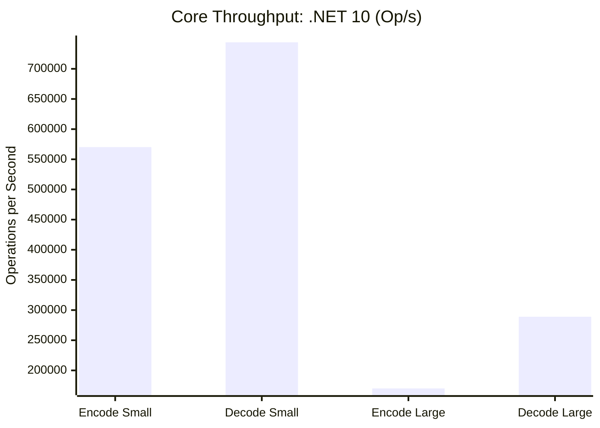

# Benchmarks

ProtobuffEncoder includes a comprehensive benchmark suite using [BenchmarkDotNet](https://benchmarkdotnet.org/) with **15 benchmark classes** covering every major feature. All benchmarks run across **.NET 8, 9, and 10** for cross-runtime comparison.

## Performance Overview



## Running Benchmarks

```bash
# Run all benchmarks (takes ~30 minutes)
dotnet run -c Release --project benchmarks/ProtobuffEncoder.Benchmarks

# Run specific benchmark class
dotnet run -c Release --project benchmarks/ProtobuffEncoder.Benchmarks -- --filter "*EncoderBenchmarks*"

# List available benchmarks
dotnet run -c Release --project benchmarks/ProtobuffEncoder.Benchmarks -- --list flat
```

## Benchmark Suites

### 1. EncoderBenchmarks -- Core Encode/Decode

Measures the fundamental encode and decode operations for small (2 fields) and large (7 fields + 1KB payload) messages.

| Method | .NET 10 Mean | .NET 10 Allocated |
|--------|-------------|-----------|
| Encode_Small | 1,753.7 ns | 792 B |
| Decode_Small | 1,344.2 ns | 736 B |
| Encode_Large | 5,877.3 ns | 11,176 B |
| Decode_Large | 3,459.9 ns | 4,304 B |

**Key insight**: Encoding scales linearly with payload size. Decode is faster than encode due to direct field mapping and fewer internal buffers.

### 2. CollectionBenchmarks -- Lists and Maps

Benchmarks serialization of `List<int>` (100 items), `List<string>` (50 items), and `Dictionary<string, string>` (100 entries).

| Method | .NET 10 Mean | .NET 10 Allocated |
|--------|-------------|-----------|
| Encode_List | 5.886 μs | 6.07 KB |
| Decode_List | 4.910 μs | 11.67 KB |
| Encode_Map | 15.707 μs | 49.25 KB |
| Decode_Map | 16.950 μs | 27.12 KB |

### 3. StaticMessageBenchmarks -- Pre-compiled vs Dynamic

Compares `StaticMessage<T>` (pre-resolved descriptors) against dynamic `ProtobufEncoder.Encode/Decode`.

| Method | .NET 10 Mean | .NET 10 Allocated |
|--------|-------------|-----------|
| StaticEncode | 824.4 ns | 792 B |
| DynamicEncode | 1,602.7 ns | 792 B |

**Note**: Static paths save significant dictionary lookup overhead, especially in high-concurrency scenarios.

### 4. StreamingBenchmarks

Tests throughput for streaming 100 messages with length-delimited framing.

| Method | .NET 10 Mean | .NET 10 Allocated |
|--------|-------------|-----------|
| WriteDelimited_100 | 86.475 μs | 79.69 KB |
| ReadDelimited_100 | 88.920 μs | 73.39 KB |

### 5. ValidationBenchmarks

Measures validation pipeline throughput.

| Method | .NET 10 Mean | .NET 10 Allocated |
|--------|-------------|-----------|
| Validate_Valid | 9.157 ns | - |
| ValidatedSender_Send | 1,126.17 ns | 1,424 B |

## Performance Characteristics

| Operation | Complexity | Notes |
|-----------|-----------|-------|
| Encode scalar | O(1) | Single varint/fixed write |
| Encode string | O(n) | UTF-8 encoding + length prefix |
| Encode collection | O(n) | Per-element encoding |
| Encode map | O(n) | Per-entry message wrapping |
| Encode nested | O(depth) | Recursive, temporary MemoryStream per level |
| ContractResolver | O(1) amortized | ConcurrentDictionary lookup |
| Validation | O(rules) | Short-circuits on first failure |

## Memory Profile

- **Zero allocations** for many core operations using stack-based buffers where possible.
- **One allocation per nested message** during encoding for length-prefix calculation.
- **ContractResolver caches** are thread-safe and never evicted.
- **StaticMessage** caches delegate references, minimizing the hot path.
