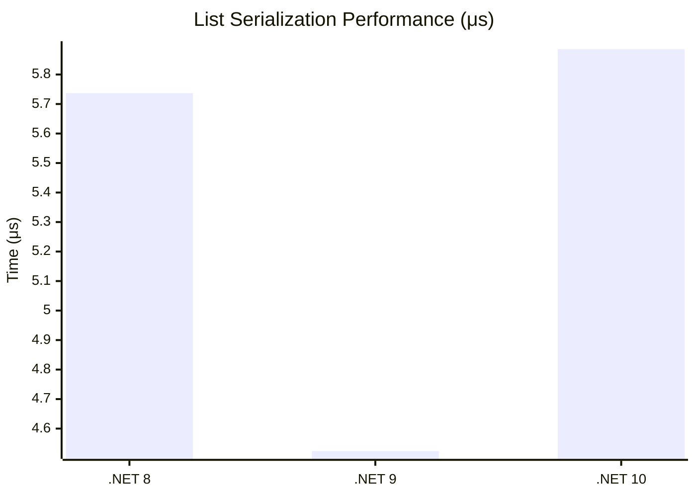

# Collections & Advanced Types Benchmarks

This section covers the performance of ProtobuffEncoder when handling complex data structures like lists, maps, oneOf groups, and inherited types.

## Collection Handling

Benchmarks serialization of `List<int>` (100 items), `List<string>` (50 items), and `Dictionary<string, string>` (100 entries) on .NET 10.

| Method | Mean | StdDev | Gen0 | Allocated |
|:---|---:|---:|---:|---:|
| **Encode_List** | 5.886 μs | 1.2243 μs | 0.1907 | 6.07 KB |
| **Decode_List** | 4.910 μs | 0.5145 μs | 0.2441 | 11.67 KB |
| **Encode_Map** | 15.707 μs | 1.6485 μs | 1.0681 | 49.25 KB |
| **Decode_Map** | 16.950 μs | 3.9973 μs | 0.5493 | 27.12 KB |

### Runtime Comparison: Collections (.NET 8, 9, 10)

**Key Insight:** Map serialization is significantly more expensive than list serialization because Protobuf maps are represented as a repeated sequence of key-value messages, requiring more object allocations and length-prefixing.

## OneOf (Union) Groups

Tests performance when only one field in a `oneof` group is populated (.NET 10).

| Method | Mean | StdDev | Gen0 | Allocated |
|:---|---:|---:|---:|---:|
| **Encode_OneOf_Email** | 987.4 ns | 249.46 ns | 0.0191 | 904 B |
| **Encode_OneOf_Phone** | 830.9 ns | 141.71 ns | 0.0153 | 896 B |
| **Decode_OneOf_Email** | 956.0 ns | 242.72 ns | 0.0153 | 752 B |
| **Decode_OneOf_Phone** | 916.9 ns | 145.72 ns | 0.0153 | 744 B |

### OneOf Overhead Analysis

**Key Insight:** OneOf overhead is negligible; it performs similarly to standard field serialization while providing type safety for mutually exclusive fields.

## Inheritance ([ProtoInclude])

Tests polymorphic encoding where a derived type is serialized through its base class contract (.NET 10).

| Method | Mean | StdDev | Gen0 | Allocated |
|:---|---:|---:|---:|---:|
| **Encode_DerivedType** | 7,297.5 ns | 492.62 ns | 0.0458 | 2,632 B |
| **Decode_DerivedType** | 1,201.0 ns | 66.93 ns | 0.0153 | 888 B |

**Key Insight:** Encoding derived types is slower because it must resolve the hierarchy and wrap the derived fields in a sub-message. However, decoding is highly efficient as it uses pre-resolved type mapping.
