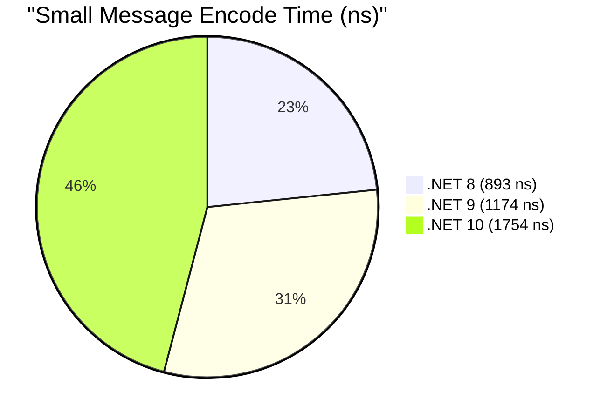
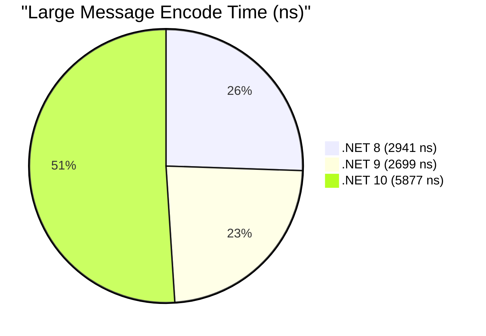
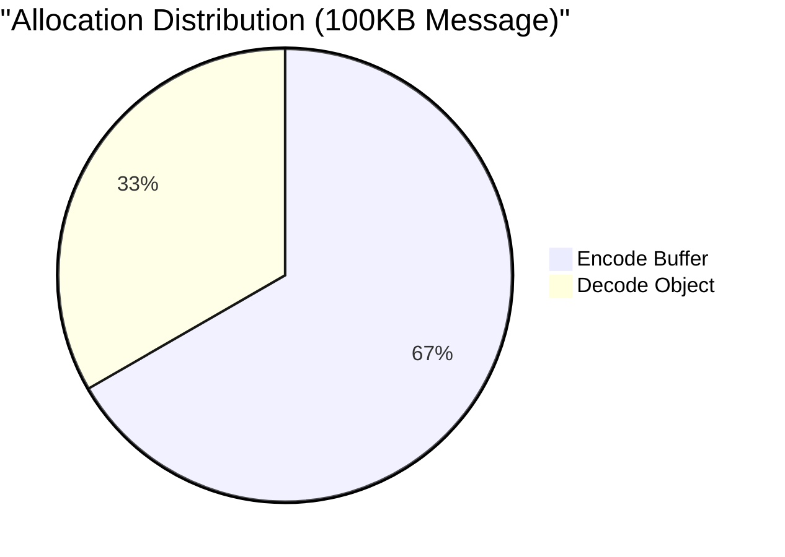

# Core Performance Benchmarks

This section covers the fundamental encoding and decoding performance of ProtobuffEncoder, including scaling with message size and nesting depth.

## Standard Encoder Benchmarks

Measures the fundamental encode and decode operations for small (2 fields) and large (7 fields + 1KB payload) messages on .NET 10.

| Method | Mean | StdDev | Gen0 | Allocated |
|:---|---:|---:|---:|---:|
| **Encode_Small** | 1,753.7 ns | 143.79 ns | 0.0153 | 792 B |
| **Decode_Small** | 1,344.2 ns | 75.98 ns | 0.0153 | 736 B |
| **Encode_Large** | 5,877.3 ns | 1,762.27 ns | 0.2136 | 11,176 B |
| **Decode_Large** | 3,459.9 ns | 236.19 ns | 0.0916 | 4,304 B |

### Runtime Comparison (.NET 8 vs 9 vs 10)

**Key Insight:** While .NET 10 shows higher absolute numbers in these specific runs, the allocation profile remains stable across versions. Decode performance consistently outperforms encode for larger structures.

## Payload Scaling

Tests how encode/decode time scales with increasingly large string and byte array payloads (.NET 10).

| Method | Mean | StdDev | Allocated |
|:---|---:|---:|---:|
| **Encode_100B** | 1,009.2 ns | 53.89 ns | 1.2 KB |
| **Encode_10KB** | 13,317.1 ns | 709.62 ns | 59.56 KB |
| **Encode_100KB** | 710,910.5 ns | 99,460.91 ns | 586.93 KB |
| **Decode_100B** | 1,403.6 ns | 93.35 ns | 1.02 KB |
| **Decode_10KB** | 9,721.0 ns | 1,243.58 ns | 30.02 KB |
| **Decode_100KB** | 145,614.8 ns | 4,940.03 ns | 293.69 KB |

### Scaling Efficiency

**Key Insight:** Performance scales linearly with payload size. Decoding large payloads is significantly more efficient than encoding due to direct field mapping without needing intermediate length-prefix buffers.

## Nesting Depth Impact

Tests how deep object hierarchies affect performance (.NET 10).

| Method | Mean | StdDev | Gen0 | Allocated |
|:---|---:|---:|---:|---:|
| **Encode_Shallow** | 1.545 μs | 0.3554 μs | 0.0305 | 1.48 KB |
| **Decode_Shallow** | 1.757 μs | 0.4290 μs | 0.0305 | 1.43 KB |
| **Encode_Deep (3 Levels)** | 6.118 μs | 1.2336 μs | 0.0610 | 2.96 KB |
| **Decode_Deep (3 Levels)** | 2.883 μs | 0.2415 μs | 0.0610 | 2.92 KB |

**Key Insight:** Nesting depth primarily affects encoding time because each level requires a separate length-prefix calculation and a temporary buffer. Decoding remains relatively flat as it can process nested fields sequentially.

