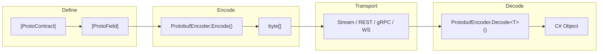

# Getting Started

This guide walks you through installing ProtobuffEncoder, defining your first contract, and performing basic encode/decode operations. By the end of this page you will have a working round-trip in under a dozen lines of code.

## Installation

Add the core package to your project:

```bash
dotnet add package ProtobuffEncoder
```

Depending on how you plan to use the library, you may also want one or more of the integration packages:

```bash
# ASP.NET Core REST and HttpClient extensions
dotnet add package ProtobuffEncoder.AspNetCore

# Code-first gRPC services
dotnet add package ProtobuffEncoder.Grpc

# WebSocket real-time communication
dotnet add package ProtobuffEncoder.WebSockets
```

## Your First Contract

A contract is simply a C# class decorated with `[ProtoContract]`. Each property you wish to serialise gets a `[ProtoField(N)]` attribute with a unique field number:

```C#
using ProtobuffEncoder.Attributes;

[ProtoContract]
public class Person
{
    [ProtoField(1)] public int Id { get; set; }
    [ProtoField(2)] public string Name { get; set; } = "";
    [ProtoField(3)] public string Email { get; set; } = "";
    [ProtoField(4)] public int Age { get; set; }
}
```

> **Tip:** Field numbers are part of the wire format. Once published, avoid changing them — this is how binary compatibility is maintained across versions.

## Encode and Decode

With the contract in place, encoding an object to binary and decoding it back is straightforward:

```C#
using ProtobuffEncoder;

// Encode to bytes
var person = new Person { Id = 1, Name = "Alice", Email = "alice@example.com", Age = 30 };
byte[] bytes = ProtobufEncoder.Encode(person);

// Decode from bytes
Person decoded = ProtobufEncoder.Decode<Person>(bytes);
Console.WriteLine(decoded.Name); // "Alice"
```

The resulting `byte[]` is a standards-compliant protobuf binary message. Any protobuf-compatible reader — in any language — can decode it.

## Async Streaming

When you need to send or receive multiple messages over a `Stream` (a file, a network socket, a pipe), use length-delimited framing. Each message is prefixed with its size so the reader knows exactly where one ends and the next begins:

```C#
// Write multiple messages
await using var file = File.Create("people.bin");
foreach (var p in people)
    await ProtobufEncoder.WriteDelimitedMessageAsync(p, file);

// Read them back
await using var reader = File.OpenRead("people.bin");
await foreach (var p in ProtobufEncoder.ReadDelimitedMessagesAsync<Person>(reader))
    Console.WriteLine(p.Name);
```

## Pre-compiled Static Messages

For performance-critical paths, create a `StaticMessage<T>`. This resolves and caches all reflection metadata up front, so every subsequent call skips the resolver lookup entirely:

```C#
var msg = ProtobufEncoder.CreateStaticMessage<Person>();

// Fast encode and decode
byte[] bytes = msg.Encode(person);
Person decoded = msg.Decode(bytes);

// Delimited streaming
msg.WriteDelimited(person, stream);
Person? next = msg.ReadDelimited(stream);
```

## Generate a .proto Schema

If you need interoperability with other languages or tools, the schema generator produces a standard `.proto` file from your C# types:

```C#
using ProtobuffEncoder.Schema;

string proto = ProtoSchemaGenerator.Generate(typeof(Person));
Console.WriteLine(proto);
```

Output:

```text
syntax = "proto3";

package MyApp.Models;

message Person {
  int32 Id = 1;
  string Name = 2;
  string Email = 3;
  int32 Age = 4;
}
```

## How It All Fits Together



## ASP.NET Core Setup

Integrating with an ASP.NET Core application takes just a few lines in `Program.cs`:

```C#
var builder = WebApplication.CreateBuilder(args);

builder.Services.AddProtobuffEncoder(options =>
{
    options.EnableMvcFormatters = true;
})
.WithRestFormatters()
.WithWebSocket(ws => ws.AddEndpoint<Message, Message>())
.WithGrpc(grpc => grpc.AddService<MyGrpcServiceImpl>());

var app = builder.Build();
```

## Where to Go Next

- **[Attributes Reference](attributes_reference.md)** — every attribute and its options
- **[Serialisation Deep Dive](serialization_deep_dive.md)** — wire format details and type mapping
- **[Auto-Discovery](auto_discovery.md)** — serialise classes without attributes using the ProtoRegistry
- **[Transport Layer](transport_layer.md)** — typed senders, receivers, and duplex streams
- **[ASP.NET Core Integration](aspnetcore_integration.md)** — REST, WebSocket, and gRPC setup
