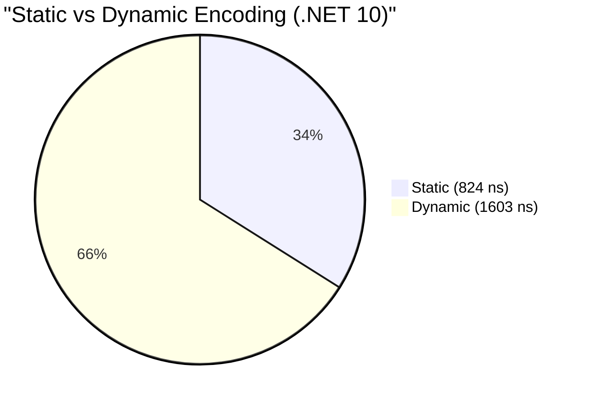

# Infrastructure & Internals Benchmarks

This section covers the performance of ProtobuffEncoder's internal infrastructure, including pre-compiled messages, validation pipelines, contract resolution, and low-level writer performance.

## Static Message vs Dynamic

Compares `StaticMessage<T>` (pre-compiled delegates) against the standard dynamic `ProtobufEncoder` methods on .NET 10.

| Method | Mean | StdDev | Gen0 | Allocated |
|:---|---:|---:|---:|---:|
| **StaticEncode** | 824.4 ns | 108.41 ns | 0.0162 | 792 B |
| **StaticDecode** | 1,027.1 ns | 41.25 ns | 0.0153 | 744 B |
| **DynamicEncode** | 1,602.7 ns | 242.42 ns | 0.0229 | 792 B |
| **DynamicDecode** | 1,078.3 ns | 110.16 ns | 0.0153 | 744 B |

### Performance Optimization: Static vs Dynamic

**Key Insight:** `StaticMessage` provides a ~50% performance boost in encoding by bypassing the `ContractResolver` dictionary lookup and using pre-compiled delegates for field access.

## Validation Pipeline

Measures the throughput of the validation pipeline with 3 rules on .NET 10.

| Method | Mean | StdDev | Gen0 | Allocated |
|:---|---:|---:|---:|---:|
| **Validate_Valid** | 9.157 ns | 0.9285 ns | - | - |
| **Validate_Invalid** | 12.003 ns | 0.5998 ns | 0.0007 | 32 B |
| **ValidatedSender_Send** | 1,126.176 ns | 54.1732 ns | 0.0286 | 1,424 B |

**Key Insight:** Validation is extremely fast (<10ns). Validated transport adds minimal overhead while providing robust safety for incoming and outgoing data.

## ContractResolver Caching

Tests the overhead of the `ContractResolver` when types are already cached (.NET 10).

| Method | Mean | StdDev | Gen0 | Allocated |
|:---|---:|---:|---:|---:|
| **FirstCall_NewType_Encode** | 1,292.8 ns | 189.54 ns | 0.0153 | 808 B |
| **CachedResolve_AllScalars** | 2,473.8 ns | 264.39 ns | 0.0153 | 1,000 B |
| **CachedResolve_Nested** | 3,413.7 ns | 816.51 ns | 0.0305 | 1,592 B |

**Key Insight:** The `ContractResolver` adds minimal overhead once a type is resolved, as it uses a `ConcurrentDictionary` for O(1) retrieval of pre-computed type metadata.

## Low-Level ProtobufWriter

Benchmarks the manual message construction using the low-level `ProtobufWriter` API (.NET 10).

| Method | Mean | StdDev | Gen0 | Allocated |
|:---|---:|---:|---:|---:|
| **Writer_SimpleMessage** | 165.9 ns | 19.95 ns | 0.0093 | 448 B |
| **Writer_NestedMessage** | 234.1 ns | 84.42 ns | 0.0181 | 872 B |
| **Writer_MapField** | 3,031.8 ns | 819.67 ns | 0.1564 | 7,472 B |
| **Writer_PackedVarints** | 768.3 ns | 40.23 ns | 0.0191 | 904 B |

### Writer Efficiency

**Key Insight:** For performance-critical code where object allocation must be avoided, the `ProtobufWriter` provides the fastest possible path to generating Protobuf-compliant binary data.

