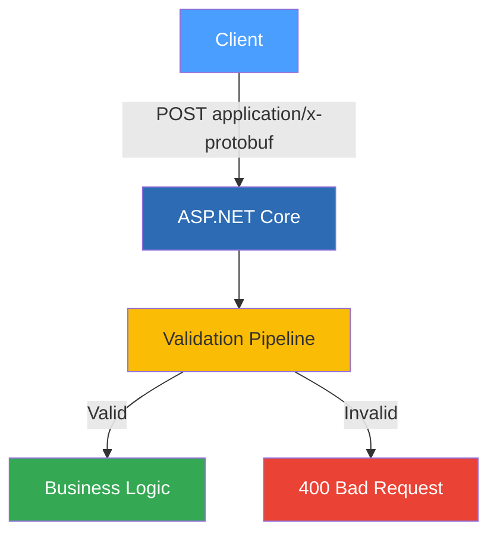

# Normal Setup

Once you are comfortable with the basics, the normal setup introduces customisation options and a validation pipeline. This is the right choice when you need naming conventions, model validation, or client-side protobuf support through `HttpClient`.

## Customising Options

Configure global serialisation options during dependency injection registration:

```C#
builder.Services.AddProtobuffEncoder(options =>
{
    options.UseCamelCase = true;
});
```

## Adding Validation

The validation pipeline lets you enforce rules on your models before they reach your business logic. Rules are registered at startup and evaluated at runtime:

```C#
builder.Services.AddProtobufValidation(registry =>
{
    registry.AddRule<DemoRequest>(
        req => !string.IsNullOrEmpty(req.Name), "Name is required");
    registry.AddRule<DemoRequest>(
        req => req.Value > 0, "Value must be positive");
});
```

Use the validator in your endpoints:

```C#
app.MapPost("/api/validated", (DemoRequest request, IProtobufValidator validator) =>
{
    var result = validator.Validate(request);
    if (!result.IsValid) return Results.BadRequest(result.Errors);

    return Results.Ok(new DemoResponse { Message = "Validated!" });
});
```

## Client-Side Support

The library provides `HttpClient` extensions to simplify sending and receiving protobuf messages from your client applications:

```C#
var client = new HttpClient();
var response = await client.PostProtobufAsync(url, myRequest);
var result = await response.Content.ReadAsProtobufAsync<MyResponse>();
```

## How It Fits Together



---

*Full source: [Program_Normal.cs](https://github.com/IsMikeTaken/ProtobuffEncoder/blob/master/demos/ProtobuffEncoder.Demo.Setup/Program_Normal.cs)*
