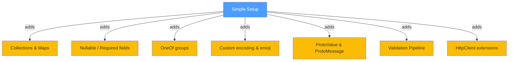

# Normal Setup

Builds on the Simple tier with collections, maps, nullable fields, OneOf groups, custom text encoding, ProtoValue for bare values, ProtoMessage for dynamic schema-less messages, and a chat service interface with multiple method types.

## What Changes from Simple



---

## Contracts

### Collections and Maps

`List<T>` fields are serialised as repeated protobuf fields. `Dictionary<K,V>` fields need a `[ProtoMap]` alongside the `[ProtoField]` number:

```C#
[ProtoContract]
public class Team
{
    [ProtoField(1)] public string Name { get; set; } = "";
    [ProtoField(2)] public List<string> Members { get; set; } = [];

    [ProtoMap]
    [ProtoField(3)] public Dictionary<string, int> Scores { get; set; } = new();
}
```

```C#
var team = new Team
{
    Name = "Platform",
    Members = ["Alice", "Bob", "Charlie"],
    Scores = new() { ["Alice"] = 95, ["Bob"] = 87, ["Charlie"] = 92 }
};

var bytes = ProtobufEncoder.Encode(team);
var decoded = ProtobufEncoder.Decode<Team>(bytes);
```

### Nullable and Required Fields

Nullable fields are omitted from the wire when `null`, saving space. The `IsRequired` flag forces the encoder to always include a field, even when it holds the type's default value:

```C#
[ProtoContract]
public class SensorReading
{
    [ProtoField(1, IsRequired = true)]
    public string SensorId { get; set; } = "";

    [ProtoField(2)] public double Value { get; set; }
    [ProtoField(3)] public DateTime Timestamp { get; set; }
    [ProtoField(4)] public double? ErrorMargin { get; set; }
}
```

### OneOf Groups

OneOf models mutually exclusive fields. Only one member of the group is serialised per message:

```C#
[ProtoContract]
public class Alert
{
    [ProtoField(1)] public int Id { get; set; }
    [ProtoField(2)] public string Text { get; set; } = "";

    [ProtoOneOf("channel")]
    [ProtoField(3)] public string? Email { get; set; }

    [ProtoOneOf("channel")]
    [ProtoField(4)] public string? Sms { get; set; }

    [ProtoOneOf("channel")]
    [ProtoField(5)] public string? Push { get; set; }
}
```

```C#
var alert = new Alert { Id = 1, Text = "CPU above 90%", Email = "ops@example.com" };
var bytes = ProtobufEncoder.Encode(alert);
var decoded = ProtobufEncoder.Decode<Alert>(bytes);
// decoded.Email = "ops@example.com", decoded.Sms = null
```

### Custom Encoding

Set `DefaultEncoding` on the contract to `"utf-8"` for full emoji support:

```C#
[ProtoContract(DefaultEncoding = "utf-8")]
public class ChatMessage
{
    [ProtoField(1)] public string Author { get; set; } = "";
    [ProtoField(2)] public string Text { get; set; } = "";
}
```

---

## ProtoValue

Encode and decode standalone values without a contract class. Useful for configuration flags, counters, or single-field payloads:

```C#
var encStr  = ProtoValue.Encode("Hello from ProtoValue");
var encInt  = ProtoValue.Encode(42);
var encGuid = ProtoValue.Encode(Guid.NewGuid());
var encDate = ProtoValue.Encode(DateTime.UtcNow);

string str  = ProtoValue.DecodeString(encStr);
int    num  = ProtoValue.DecodeInt32(encInt);
Guid   id   = ProtoValue.DecodeGuid(encGuid);
```

## ProtoMessage

Build messages dynamically without any contract class. Fields are set and retrieved by number. Nested ProtoMessages are supported:

```C#
var msg = new ProtoMessage()
    .Set(1, "ProtobuffEncoder")
    .Set(2, 42)
    .Set(3, true)
    .Set(4, DateTime.UtcNow)
    .Set(5, new ProtoMessage()
        .Set(1, "nested-child")
        .Set(2, 100));

var bytes = msg.ToBytes();
var decoded = ProtoMessage.FromBytes(bytes);
string name = decoded.GetString(1);
ProtoMessage? child = decoded.GetMessage(5);
```

---

## Service Interface

The chat service below uses both Unary and DuplexStreaming method types:

```C#
[ProtoContract]
public class ChatReply
{
    [ProtoField(1)] public string Text { get; set; } = "";
    [ProtoField(2)] public bool IsSystem { get; set; }
}

[ProtoService("ChatService")]
public interface IChatService
{
    [ProtoMethod(ProtoMethodType.Unary)]
    Task<ChatReply> Send(ChatMessage message);

    [ProtoMethod(ProtoMethodType.DuplexStreaming)]
    IAsyncEnumerable<ChatReply> LiveChat(
        IAsyncEnumerable<ChatMessage> messages,
        CancellationToken ct = default);
}
```

---

## REST

### Builder Pattern and Validation

Use the fluent builder for centralised configuration across all transports:

```C#
builder.Services.AddProtobuffEncoder(options =>
{
    options.EnableMvcFormatters = true;
    options.DefaultInvalidMessageBehavior = InvalidMessageBehavior.Throw;
    options.OnGlobalValidationFailure = (message, result) =>
        Console.WriteLine($"[Validation] {message.GetType().Name}: {result.ErrorMessage}");
})
.AddProtobufValidation()
.WithRestFormatters();
```

### HttpClient Round-Trip

`PostProtobufAsync` encodes the request, sends it with the correct content type, and decodes the response in one call:

```C#
builder.Services.AddHttpClient("DownstreamApi", client =>
    client.BaseAddress = new Uri("http://localhost:5000"));

app.MapGet("/api/round-trip", async (IHttpClientFactory factory) =>
{
    var client = factory.CreateClient("DownstreamApi");
    var forecast = await client.PostProtobufAsync<WeatherRequest, WeatherForecast>(
        "/api/weather",
        new WeatherRequest { City = "London", Days = 3 });
    return Results.Ok(forecast);
});
```

*Full source: [Normal/Rest/Program.cs](https://github.com/IsMikeTaken/ProtobuffEncoder/blob/master/demos/Setup/Normal/Rest/Program.cs)*

---

## WebSockets

### Validation Pipeline

The Normal tier adds a validation pipeline on the receive side. Messages that fail validation are rejected before `OnMessage` fires:

```C#
app.MapProtobufWebSocket<ChatReply, ChatMessage>("/ws/chat", options =>
{
    options.ConfigureReceiveValidation = pipeline =>
    {
        pipeline.Require(msg => !string.IsNullOrWhiteSpace(msg.Author), "Author is required.");
        pipeline.Require(msg => !string.IsNullOrWhiteSpace(msg.Text), "Text cannot be empty.");
        pipeline.Require(msg => msg.Text.Length <= 500, "Text must be 500 characters or fewer.");
    };

    options.OnInvalidReceive = InvalidMessageBehavior.Skip;

    options.OnMessageRejected = (connection, message, result) =>
        connection.SendAsync(new ChatReply
        {
            Text = $"Rejected: {result.ErrorMessage}", IsSystem = true
        });

    options.OnMessage = (connection, message) =>
        connection.SendAsync(new ChatReply
        {
            Text = $"{message.Author}: {message.Text}"
        });
});
```

*Full source: [Normal/WebSockets/Program.cs](https://github.com/IsMikeTaken/ProtobuffEncoder/blob/master/demos/Setup/Normal/WebSockets/Program.cs)*

---

## gRPC

### Kestrel Port Configuration and Assembly Discovery

Separate HTTP/1.1 traffic from HTTP/2. `AddServiceAssembly` scans for every `[ProtoService]` implementation automatically:

```C#
builder.Services.AddProtobuffEncoder(options =>
{
    options.DefaultInvalidMessageBehavior = InvalidMessageBehavior.Throw;
})
.WithGrpc(grpc => grpc
    .UseKestrel(httpPort: 5000, grpcPort: 5001)
    .AddServiceAssembly(typeof(Program).Assembly));

var app = builder.Build();
app.MapProtobufEndpoints();
app.MapGet("/health", () => Results.Ok(new { status = "ok" }));
```

*Full source: [Normal/Grpc/Program.cs](https://github.com/IsMikeTaken/ProtobuffEncoder/blob/master/demos/Setup/Normal/Grpc/Program.cs)*

---

## Running the Template

```bash
dotnet run --project templates/ProtobuffEncoder.Template.Normal
```

Expected output:

```text
ProtobuffEncoder — Normal Template

Team: Platform, 3 members
  Alice: 95
  Bob: 87
  Charlie: 92

Nullable and required fields...
  Sensor temp-01: 22.5, margin=N/A

OneOf groups...
  Alert #1: via email=ops@example.com, sms=(none)

Custom encoding with emoji...
  Alice: Deploying now 🚀 wish me luck 🍀

ProtoValue (bare values)...
  string: Hello from ProtoValue (21 bytes)
  int:    42
  guid:   <generated>
  date:   2026-03-25 10:00:00

ProtoMessage (dynamic, no contract needed)...
  5 fields, 48 bytes
  Field 1: ProtobuffEncoder
  Field 2: 42
  Field 5 (nested): nested-child

Service interface declared: IChatService
  Send(ChatMessage)    -> ChatReply        [Unary]
  LiveChat(stream)     -> stream           [DuplexStreaming]
```
