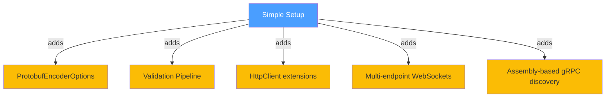
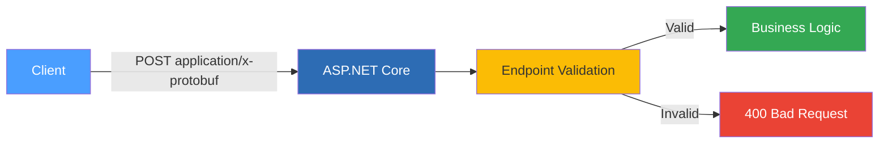

# Normal Setup

Once you are comfortable with the basics, the Normal tier introduces the builder pattern, global options, validation pipelines, and `HttpClient` extensions. This is the right choice when you need centralised configuration, input validation, or service-to-service protobuf communication.

## What Changes from Simple



---

## REST

### Builder Pattern and Options

Instead of calling `AddProtobufFormatters()` directly, use the fluent builder. This gives you a single point of configuration for all transports:

```C#
builder.Services.AddProtobuffEncoder(options =>
{
    // Enable MVC formatters for controllers and Minimal APIs.
    options.EnableMvcFormatters = true;

    // Reject invalid messages instead of silently skipping them.
    options.DefaultInvalidMessageBehavior = InvalidMessageBehavior.Throw;

    // Optional: centralised hook for logging every validation failure.
    options.OnGlobalValidationFailure = (message, result) =>
        Console.WriteLine($"[Validation] {message.GetType().Name}: {result.ErrorMessage}");
})
.WithRestFormatters();
```

### Endpoint Validation

With the Normal tier you typically validate at the endpoint level:

```C#
app.MapPost("/api/order", (OrderRequest order) =>
{
    if (string.IsNullOrWhiteSpace(order.ProductName))
        return Results.BadRequest("ProductName is required.");
    if (order.Quantity < 1)
        return Results.BadRequest("Quantity must be at least 1.");

    return Results.Ok(new OrderConfirmation
    {
        OrderId = Guid.NewGuid().ToString("N")[..8],
        Total = order.Quantity * order.UnitPrice
    });
});
```

### HttpClient Round-Trip

The library provides `HttpClient` extensions for calling other protobuf services. `PostProtobufAsync` encodes the request, sends it with the correct content type, and decodes the response — all in one call:

```C#
builder.Services.AddHttpClient("DownstreamApi", client =>
{
    client.BaseAddress = new Uri("http://localhost:5000");
});

app.MapGet("/api/round-trip", async (IHttpClientFactory factory) =>
{
    var client = factory.CreateClient("DownstreamApi");

    var confirmation = await client.PostProtobufAsync<OrderRequest, OrderConfirmation>(
        "/api/order",
        new OrderRequest { ProductName = "Widget", Quantity = 3, UnitPrice = 9.99 });

    return Results.Ok(new { confirmation.OrderId, confirmation.Total });
});
```



*Full source: [Normal/Rest/Program.cs](https://github.com/IsMikeTaken/ProtobuffEncoder/blob/master/demos/Setup/Normal/Rest/Program.cs)*

---

## WebSockets

### Validation Pipeline

The Normal tier adds a `ValidationPipeline` on the receive side. Messages that fail validation are rejected before `OnMessage` fires:

```C#
app.MapProtobufWebSocket<ChatReply, ChatMessage>("/ws/chat", options =>
{
    // Validate every incoming message.
    options.ConfigureReceiveValidation = pipeline =>
    {
        pipeline.Require(msg => !string.IsNullOrWhiteSpace(msg.User), "User is required.");
        pipeline.Require(msg => !string.IsNullOrWhiteSpace(msg.Text), "Text cannot be empty.");
        pipeline.Require(msg => msg.Text.Length <= 500, "Text must be 500 characters or fewer.");
    };

    // Skip invalid messages rather than closing the connection.
    options.OnInvalidReceive = InvalidMessageBehavior.Skip;

    // Notify the sender when a message is rejected.
    options.OnMessageRejected = (connection, message, result) =>
    {
        Console.WriteLine($"[Rejected] {connection.ConnectionId}: {result.ErrorMessage}");
        return connection.SendAsync(new ChatReply
        {
            Text = $"Your message was rejected: {result.ErrorMessage}",
            IsSystem = true
        });
    };

    options.OnMessage = (connection, message) =>
    {
        Console.WriteLine($"[Chat] {message.User}: {message.Text}");
        return connection.SendAsync(new ChatReply
        {
            Text = $"{message.User} says: {message.Text}"
        });
    };
});
```

### Multiple Endpoints

You can register more than one type pair and map each to a different path:

```C#
builder.Services.AddProtobufWebSocketEndpoint<ChatReply, ChatMessage>();
builder.Services.AddProtobufWebSocketEndpoint<DemoResponse, DemoRequest>();

// ...

app.MapProtobufWebSocket<ChatReply, ChatMessage>("/ws/chat", options => { /* ... */ });
app.MapProtobufWebSocket<DemoResponse, DemoRequest>("/ws/echo", options =>
{
    options.OnMessage = (connection, request) =>
        connection.SendAsync(new DemoResponse { Message = $"Echo: {request.Name}" });
});
```

*Full source: [Normal/WebSockets/Program.cs](https://github.com/IsMikeTaken/ProtobuffEncoder/blob/master/demos/Setup/Normal/WebSockets/Program.cs)*

---

## gRPC

### Kestrel Port Configuration

In production you typically separate HTTP/1.1 traffic (health checks, dashboards) from HTTP/2 traffic (gRPC). The `UseKestrel` method configures both:

```C#
builder.Services.AddProtobuffEncoder(options =>
{
    options.DefaultInvalidMessageBehavior = InvalidMessageBehavior.Throw;
})
.WithGrpc(grpc => grpc
    .UseKestrel(httpPort: 5000, grpcPort: 5001)
    .AddServiceAssembly(typeof(Program).Assembly));
```

### Assembly-Based Service Discovery

`AddServiceAssembly` scans the given assembly for every class that implements an `[ProtoService]` interface. No manual `AddService<T>()` calls are needed — add an implementation and it appears automatically:

```C#
var app = builder.Build();
app.MapProtobufEndpoints();

// Health check on the HTTP/1.1 port.
app.MapGet("/health", () => Results.Ok(new { status = "ok" }));
```

*Full source: [Normal/Grpc/Program.cs](https://github.com/IsMikeTaken/ProtobuffEncoder/blob/master/demos/Setup/Normal/Grpc/Program.cs)*

---

## Running the Demos

```bash
# REST
dotnet run --project demos/Setup/Normal/Rest

# WebSockets
dotnet run --project demos/Setup/Normal/WebSockets

# gRPC
dotnet run --project demos/Setup/Normal/Grpc
```
