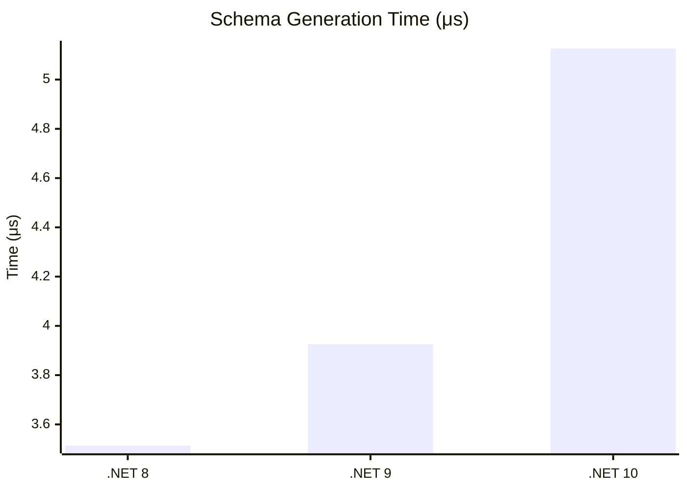

# Schema Operations Benchmarks

This section covers the performance of dynamic schema-related operations, including .proto generation, schema parsing, and schema-based decoding on .NET 10.

## Schema Generation

Measures the time to generate a `.proto` schema string from C# types using reflection (.NET 10).

| Method | Mean | StdDev | Gen0 | Allocated |
|:---|---:|---:|---:|---:|
| **Generate_SimpleMessage** | 5.126 μs | 0.5695 μs | 0.0763 | 3.95 KB |
| **Generate_NestedMessage** | 9.847 μs | 0.3443 μs | 0.1526 | 7.16 KB |
| **Generate_AllScalars** | 4.186 μs | 0.6984 μs | 0.1221 | 5.8 KB |
| **Generate_WithOneOf** | 6.648 μs | 0.7632 μs | 0.0992 | 4.6 KB |
| **Generate_WithMap** | 6.161 μs | 0.5743 μs | 0.0916 | 3.85 KB |

### Runtime Comparison: Schema Generation

**Key Insight:** Schema generation is a reflection-heavy operation. While not intended for hot-path use, it is efficient enough to be used for dynamic discovery or on-the-fly schema serving.

## Parsing & Schema Decoding

Measures the performance of the `ProtoSchemaParser` and the `SchemaDecoder` (.NET 10).

| Method | Mean | StdDev | Gen0 | Allocated |
|:---|---:|---:|---:|---:|
| **Parse_Proto** | 1,966.8 ns | 90.60 ns | 0.0992 | 4,952 B |
| **SchemaDecoder_Decode** | 320.9 ns | 22.63 ns | 0.0145 | 696 B |

**Key Insight:** Once a schema is parsed, the `SchemaDecoder` is extremely fast at extracting data from binary Protobuf messages, making it an excellent choice for generic proxies or data inspection tools where C# models are not available.
