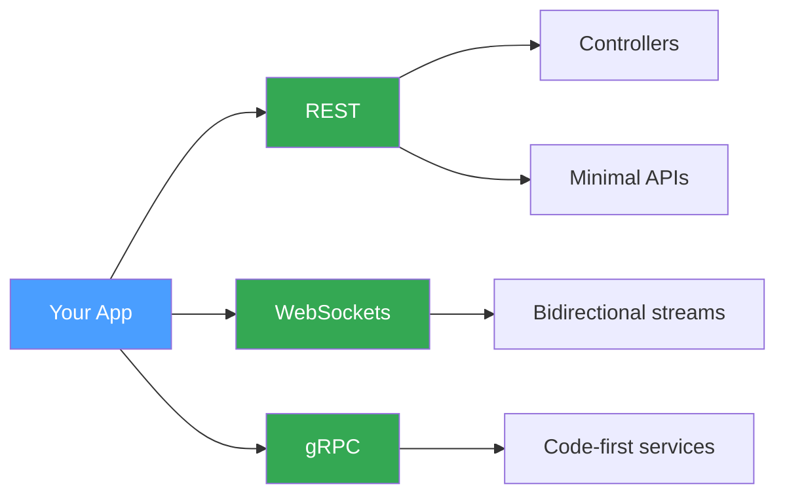

# Simple Setup

The fastest way to start with ProtobuffEncoder. This guide covers contracts, encoding, decoding, streaming, and declaring a service interface. Each transport — REST, WebSockets, and gRPC — requires only a single registration call.

## What You Get



---

## Contracts

Every message starts as a C# class decorated with `[ProtoContract]`. Properties are marked with `[ProtoField(n)]` where `n` is the protobuf field number. Nested types and collections work out of the box.

```C#
[ProtoContract]
public class WeatherRequest
{
    [ProtoField(1)] public string City { get; set; } = "";
    [ProtoField(2)] public int Days { get; set; }
    [ProtoField(3)] public bool IncludeWind { get; set; }
}

[ProtoContract]
public class WeatherForecast
{
    [ProtoField(1)] public string City { get; set; } = "";
    [ProtoField(2)] public List<DayEntry> Entries { get; set; } = [];
}

[ProtoContract]
public class DayEntry
{
    [ProtoField(1)] public string Date { get; set; } = "";
    [ProtoField(2)] public double HighC { get; set; }
    [ProtoField(3)] public double LowC { get; set; }
    [ProtoField(4)] public string Condition { get; set; } = "";
}
```

## Encode and Decode

`ProtobufEncoder.Encode` serialises any `[ProtoContract]` to a byte array. `Decode<T>` reverses the operation.

```C#
var request = new WeatherRequest { City = "London", Days = 3, IncludeWind = true };

byte[] encoded = ProtobufEncoder.Encode(request);
var decoded = ProtobufEncoder.Decode<WeatherRequest>(encoded);
```

Nested contracts follow the same pattern. The encoder handles repeated fields and child messages automatically:

```C#
var forecast = new WeatherForecast
{
    City = "London",
    Entries =
    [
        new DayEntry { Date = "2026-03-25", HighC = 14.5, LowC = 7.2, Condition = "Partly cloudy" },
        new DayEntry { Date = "2026-03-26", HighC = 16.0, LowC = 8.1, Condition = "Sunny" }
    ]
};

var bytes = ProtobufEncoder.Encode(forecast);
var result = ProtobufEncoder.Decode<WeatherForecast>(bytes);
```

## Streaming

Length-delimited streaming writes multiple messages to a single stream and reads them back one by one. This is the foundation for gRPC server-streaming and transport layers.

```C#
using var stream = new MemoryStream();

for (int i = 1; i <= 3; i++)
    ProtobufEncoder.WriteDelimitedMessage(new WeatherForecast { City = $"City-{i}" }, stream);

stream.Position = 0;
foreach (var msg in ProtobufEncoder.ReadDelimitedMessages<WeatherForecast>(stream))
    Console.WriteLine(msg.City);
```

A static (pre-compiled) encoder avoids repeated reflection when you encode the same type many times:

```C#
var staticMsg = ProtobufEncoder.CreateStaticMessage<WeatherRequest>();
var fastBytes = staticMsg.Encode(request);
var fastDecoded = staticMsg.Decode(fastBytes);
```

---

## Service Interface

Define a service contract with `[ProtoService]` and `[ProtoMethod]`. No `.proto` files, no code generation. The interface below declares the methods that the gRPC integration package maps to HTTP/2 endpoints.

```C#
[ProtoService("WeatherService")]
public interface IWeatherService
{
    [ProtoMethod(ProtoMethodType.Unary)]
    Task<WeatherForecast> GetForecast(WeatherRequest request);

    [ProtoMethod(ProtoMethodType.ServerStreaming)]
    IAsyncEnumerable<WeatherForecast> StreamForecasts(
        WeatherRequest request, CancellationToken ct = default);
}
```

---

## REST

Add protobuf formatters to your MVC pipeline. Both controllers and Minimal APIs then accept and return `application/x-protobuf` bodies alongside JSON.

```C#
var builder = WebApplication.CreateBuilder(args);

builder.Services.AddControllers()
    .AddProtobufFormatters();

var app = builder.Build();
```

Minimal APIs pick up the registered formatters automatically:

```C#
app.MapPost("/api/weather", (WeatherRequest request) =>
    new WeatherForecast
    {
        City = request.City,
        Entries = [new DayEntry { Date = "2026-03-25", HighC = 14.5, LowC = 7.2, Condition = "Sunny" }]
    });
```

> **Tip:** Send a request with `Content-Type: application/x-protobuf` and `Accept: application/x-protobuf` to use the binary format. Omit those headers and you get standard JSON.

*Full source: [Simple/Rest/Program.cs](https://github.com/IsMikeTaken/ProtobuffEncoder/blob/master/demos/Setup/Simple/Rest/Program.cs)*

---

## WebSockets

Register an endpoint type pair, map a path, and supply an `OnMessage` handler. The framework manages connections, framing, and lifecycle events.

```C#
var builder = WebApplication.CreateBuilder(args);

builder.Services.AddProtobufWebSocketEndpoint<WeatherForecast, WeatherRequest>();

var app = builder.Build();
app.UseWebSockets();

app.MapProtobufWebSocket<WeatherForecast, WeatherRequest>("/ws/weather", options =>
{
    options.OnConnect = connection =>
    {
        Console.WriteLine($"[+] {connection.ConnectionId} connected");
        return Task.CompletedTask;
    };

    options.OnMessage = (connection, request) =>
        connection.SendAsync(new WeatherForecast
        {
            City = request.City,
            Entries = [new DayEntry { Date = "2026-03-25", HighC = 14.5, LowC = 7.2, Condition = "Sunny" }]
        });
});
```

*Full source: [Simple/WebSockets/Program.cs](https://github.com/IsMikeTaken/ProtobuffEncoder/blob/master/demos/Setup/Simple/WebSockets/Program.cs)*

---

## gRPC

Implement the service interface and register it through the builder. The framework maps each `[ProtoMethod]` to an HTTP/2 endpoint.

```C#
public class WeatherServiceImpl : IWeatherService
{
    public Task<WeatherForecast> GetForecast(WeatherRequest request)
        => Task.FromResult(new WeatherForecast
        {
            City = request.City,
            Entries = [new DayEntry { Date = "2026-03-25", HighC = 14.5, LowC = 7.2, Condition = "Sunny" }]
        });

    public async IAsyncEnumerable<WeatherForecast> StreamForecasts(
        WeatherRequest request, [EnumeratorCancellation] CancellationToken ct = default)
    {
        for (int i = 0; i < request.Days && !ct.IsCancellationRequested; i++)
        {
            yield return new WeatherForecast { City = request.City };
            await Task.Delay(500, ct);
        }
    }
}
```

```C#
var builder = WebApplication.CreateBuilder(args);

builder.Services.AddProtobuffEncoder()
    .WithGrpc(grpc => grpc.AddService<WeatherServiceImpl>());

var app = builder.Build();
app.MapProtobufEndpoints();
```

*Full source: [Simple/Grpc/Program.cs](https://github.com/IsMikeTaken/ProtobuffEncoder/blob/master/demos/Setup/Simple/Grpc/Program.cs)*

---

## Running the Template

The console template demonstrates all of the above without needing a web server:

```bash
dotnet run --project templates/ProtobuffEncoder.Template.Simple
```

Expected output:

```text
ProtobuffEncoder — Simple Template

Encoded WeatherRequest to 12 bytes
Decoded: City=London, Days=3, IncludeWind=True

Forecast for London: 3 day(s)
  2026-03-25  7.2–14.5 C  Partly cloudy
  2026-03-26  8.1–16 C  Sunny
  2026-03-27  6.9–12.3 C  Rain

Streaming three forecasts into a MemoryStream...
  Read back: City-1
  Read back: City-2
  Read back: City-3

Static encoder round-trip...
  London, 3 day(s) — 12 bytes

Service interface declared: IWeatherService
  GetForecast(WeatherRequest) -> WeatherForecast   [Unary]
  StreamForecasts(WeatherRequest) -> stream         [ServerStreaming]
```
