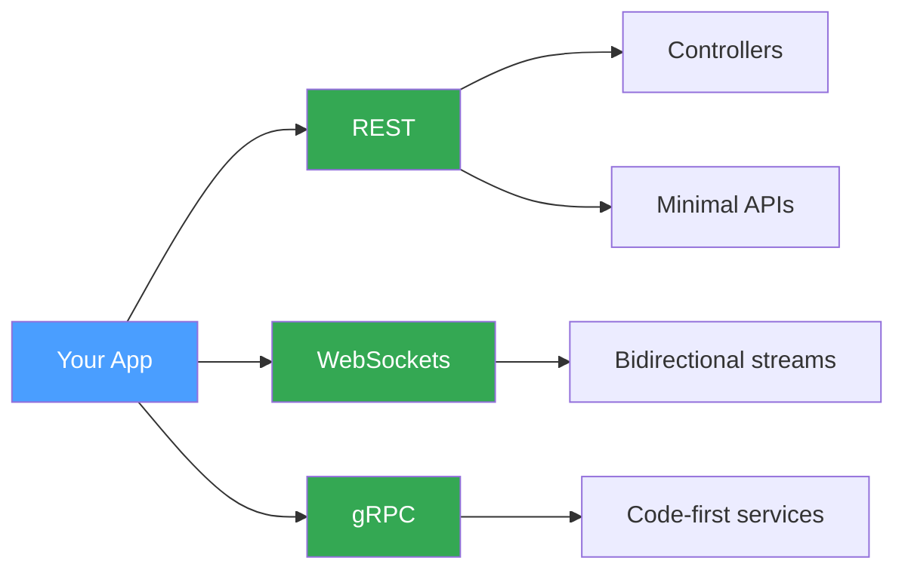

# Simple Setup

The fastest way to get ProtobuffEncoder running in an ASP.NET Core application. Each transport — REST, WebSockets, and gRPC — requires only a single registration call. No custom configuration, no options objects; just wire it up and go.

## What You Get



Each transport has its own dedicated demo project with a standalone `Program.cs` you can run immediately.

---

## REST

Add protobuf formatters to your MVC pipeline. Both controllers and Minimal APIs will then accept and return `application/x-protobuf` bodies alongside JSON.

### Service Registration

```C#
var builder = WebApplication.CreateBuilder(args);

builder.Services.AddControllers()
    .AddProtobufFormatters();

var app = builder.Build();
```

### Minimal API

Minimal APIs pick up the registered formatters automatically:

```C#
app.MapPost("/api/echo", (DemoRequest request) =>
    new DemoResponse { Message = $"Echo: {request.Name}, value={request.Value}" });

app.MapPost("/api/order", (OrderRequest order) =>
    new OrderConfirmation
    {
        OrderId = Guid.NewGuid().ToString("N")[..8],
        Total = order.Quantity * order.UnitPrice
    });
```

### Controller

Decorate your action methods as usual — the `ProtobufInputFormatter` and `ProtobufOutputFormatter` handle the rest:

```C#
[ApiController]
[Route("api/[controller]")]
public class DemoController : ControllerBase
{
    [HttpPost("echo")]
    public ActionResult<DemoResponse> Echo([FromBody] DemoRequest request)
        => Ok(new DemoResponse { Message = $"Controller Echo: {request.Name}" });
}
```

> **Tip:** Send a request with `Content-Type: application/x-protobuf` and `Accept: application/x-protobuf` to use the binary format. Omit those headers and you get standard JSON.

*Full source: [Simple/Rest/Program.cs](https://github.com/IsMikeTaken/ProtobuffEncoder/blob/master/demos/Setup/Simple/Rest/Program.cs)*

---

## WebSockets

Register an endpoint type pair, map a path, and supply an `OnMessage` handler. The framework manages connections, framing, and lifecycle events.

### Service Registration

```C#
var builder = WebApplication.CreateBuilder(args);

// Register the type pair — creates a WebSocketConnectionManager singleton.
builder.Services.AddProtobufWebSocketEndpoint<ChatReply, ChatMessage>();

var app = builder.Build();
app.UseWebSockets();
```

### Mapping the Endpoint

```C#
app.MapProtobufWebSocket<ChatReply, ChatMessage>("/ws/chat", options =>
{
    options.OnConnect = connection =>
    {
        Console.WriteLine($"[+] Client connected: {connection.ConnectionId}");
        return connection.SendAsync(new ChatReply
        {
            Text = "Welcome! Send a ChatMessage to start chatting.",
            IsSystem = true
        });
    };

    options.OnMessage = (connection, message) =>
    {
        Console.WriteLine($"[{message.User}] {message.Text}");
        return connection.SendAsync(new ChatReply
        {
            Text = $"Server received: \"{message.Text}\""
        });
    };

    options.OnDisconnect = connection =>
    {
        Console.WriteLine($"[-] Client disconnected: {connection.ConnectionId}");
        return Task.CompletedTask;
    };
});
```

*Full source: [Simple/WebSockets/Program.cs](https://github.com/IsMikeTaken/ProtobuffEncoder/blob/master/demos/Setup/Simple/WebSockets/Program.cs)*

---

## gRPC

Define a service interface with `[ProtoService]`, implement it, and register through the builder. No `.proto` files, no `protoc`, no code generation.

### Service Contract

```C#
[ProtoService("DemoService")]
public interface IDemoGrpcService
{
    [ProtoMethod(ProtoMethodType.Unary)]
    Task<DemoResponse> Echo(DemoRequest request);

    [ProtoMethod(ProtoMethodType.Unary)]
    Task<OrderConfirmation> PlaceOrder(OrderRequest request);
}
```

### Service Registration

```C#
var builder = WebApplication.CreateBuilder(args);

builder.Services.AddProtobuffEncoder()
    .WithGrpc(grpc => grpc.AddService<DemoGrpcServiceImpl>());

var app = builder.Build();
app.MapProtobufEndpoints();
```

### Implementation

```C#
public class DemoGrpcServiceImpl : IDemoGrpcService
{
    public Task<DemoResponse> Echo(DemoRequest request)
        => Task.FromResult(new DemoResponse
        {
            Message = $"gRPC Echo: {request.Name}, value={request.Value}"
        });

    public Task<OrderConfirmation> PlaceOrder(OrderRequest request)
        => Task.FromResult(new OrderConfirmation
        {
            OrderId = Guid.NewGuid().ToString("N")[..8],
            Total = request.Quantity * request.UnitPrice
        });
}
```

*Full source: [Simple/Grpc/Program.cs](https://github.com/IsMikeTaken/ProtobuffEncoder/blob/master/demos/Setup/Simple/Grpc/Program.cs)*

---

## Running the Demos

```bash
# REST
dotnet run --project demos/Setup/Simple/Rest

# WebSockets
dotnet run --project demos/Setup/Simple/WebSockets

# gRPC
dotnet run --project demos/Setup/Simple/Grpc
```
