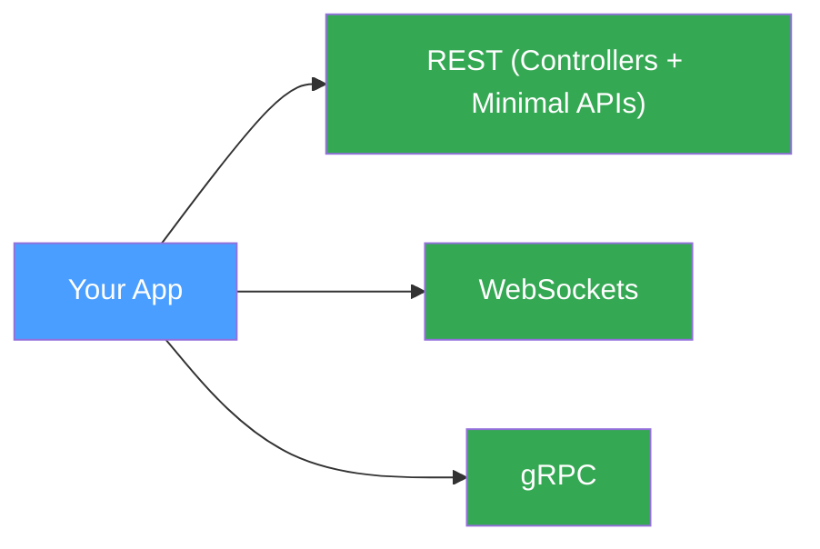

# Simple Setup

The fastest way to get ProtobuffEncoder running in an ASP.NET Core application. This setup uses the default extension methods and requires no custom configuration — ideal when you simply need protobuf support alongside your existing JSON endpoints.

## What You Get



## Service Registration

Add the protobuf formatters to your MVC controllers or Minimal APIs in `Program.cs`:

```C#
var builder = WebApplication.CreateBuilder(args);

// 1. REST Support — adds input and output formatters for application/x-protobuf
builder.Services.AddControllers()
    .AddProtobufFormatters();

// 2. WebSocket Support (optional)
builder.Services.AddProtobufWebSocketEndpoint<Req, Res>();

// 3. gRPC Support (optional)
builder.Services.AddProtobuffEncoder()
    .WithGrpc(grpc => grpc.AddService<MyService>());
```

That is all you need. The formatters automatically handle serialisation and deserialisation whenever a request or response carries the `application/x-protobuf` content type.

## Usage

### Minimal API

Minimal APIs pick up the registered formatters automatically:

```C#
app.MapPost("/echo", (MyMessage msg) => msg);
```

### Controllers

Decorate your action methods as usual. The `ProtobufInputFormatter` and `ProtobufOutputFormatter` take care of the rest:

```C#
[ApiController]
[Route("[controller]")]
public class MyController : ControllerBase
{
    [HttpPost]
    public IActionResult Post([FromBody] MyMessage msg) => Ok(msg);
}
```

### WebSockets

Map your protobuf WebSocket endpoints with a single call:

```C#
app.MapProtobufWebSocket<Res, Req>("/ws/echo");
```

---

*Full source: [Program_Simple.cs](https://github.com/IsMikeTaken/ProtobuffEncoder/blob/master/demos/ProtobuffEncoder.Demo.Setup/Program_Simple.cs)*
