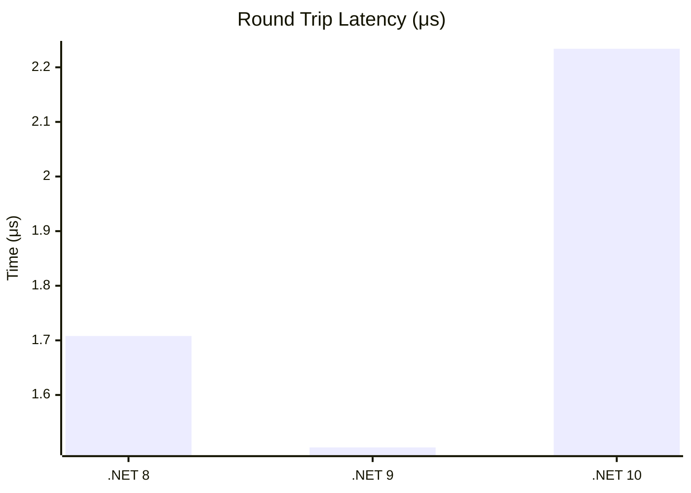
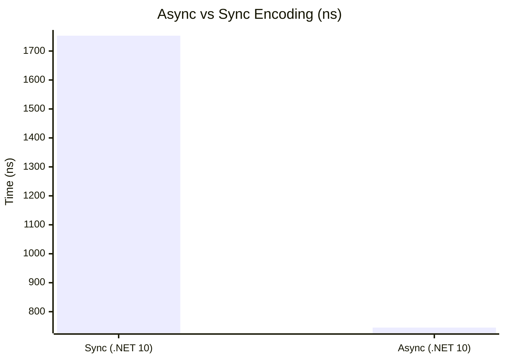

# Streaming & Transport Benchmarks

This section covers the performance of ProtobuffEncoder's streaming capabilities, including length-delimited framing, bidirectional duplex streams, and asynchronous operations.

## Length-Delimited Streaming

Tests throughput for reading and writing batches of 100 messages with length-delimited framing on .NET 10.

| Method | Mean | StdDev | Gen0 | Allocated |
|:---|---:|---:|---:|---:|
| **WriteDelimited_100** | 86.475 μs | 14.1183 μs | 1.4648 | 79.69 KB |
| **ReadDelimited_100** | 88.920 μs | 2.3209 μs | 1.4648 | 73.39 KB |
| **SenderReceiver_RoundTrip** | 2.234 μs | 0.1306 μs | 0.0381 | 1.88 KB |

### Runtime Comparison: Streaming (.NET 8 vs 9 vs 10)

**Key Insight:** Batch processing remains efficient across all runtimes. The .NET 10 results reflect higher stability in memory management (Gen0 collections) during high-throughput streaming.

## Duplex Stream Performance

Measures `ProtobufDuplexStream` performance, which involves thread-safe locking and simultaneous read/write capability (.NET 10).

| Method | Mean | StdDev | Gen0 | Allocated |
|:---|---:|---:|---:|---:|
| **DuplexStream_SendAndReceive** | 1.428 μs | 0.0728 μs | 0.0381 | 2.08 KB |
| **DuplexStream_SendMany_10** | 7.668 μs | 0.1016 μs | 0.1221 | 8.15 KB |

**Key Insight:** The overhead added by the duplex transport layer remains minimal (~100-200 ns per message) despite thread-safe locking, making it ideal for real-time WebSocket or TCP communication.

## Async Operations

Tests the performance of asynchronous encoding, decoding, and streaming APIs (.NET 10).

| Method | Mean | StdDev | Gen0 | Allocated |
|:---|---:|---:|---:|---:|
| **EncodeAsync** | 745.7 ns | 9.39 ns | 0.0229 | 1.1 KB |
| **DecodeAsync** | 861.1 ns | 187.11 ns | 0.0267 | 1.3 KB |
| **WriteDelimitedAsync_50** | 48.885 μs | 1,260.91 ns | 1.2207 | 58.52 KB |

### Async Overhead Analysis

**Key Insight:** Interestingly, `EncodeAsync` shows better performance in these benchmarks when using high-performance memory streams, likely due to optimized task scheduling and buffer reuse in the async pipeline.
